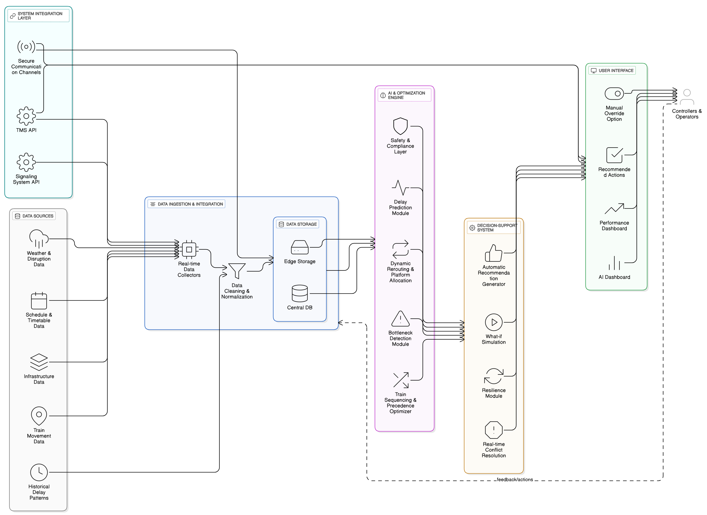
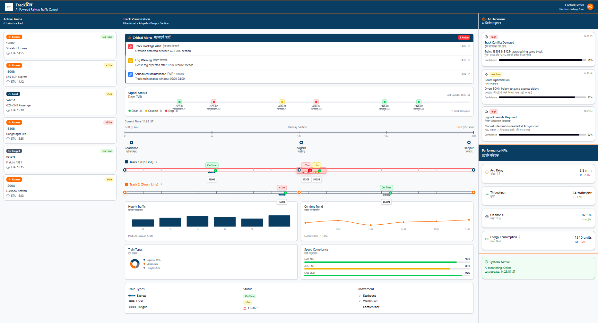
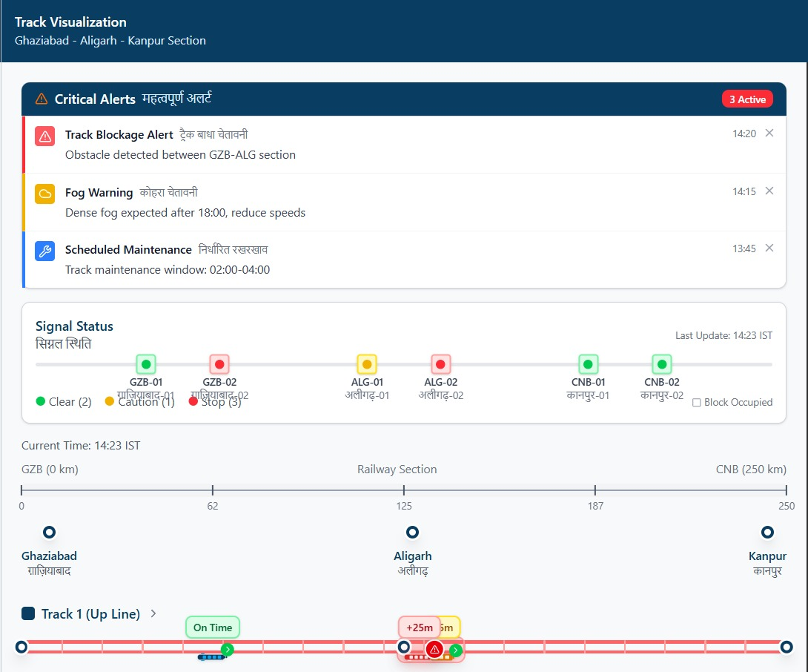
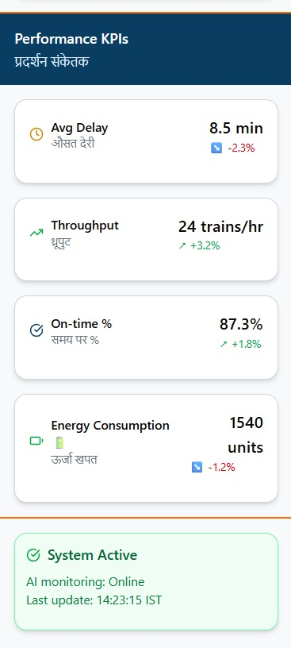
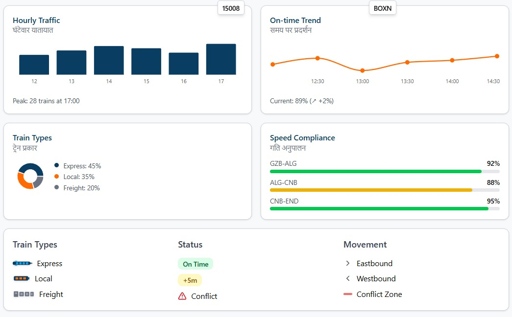
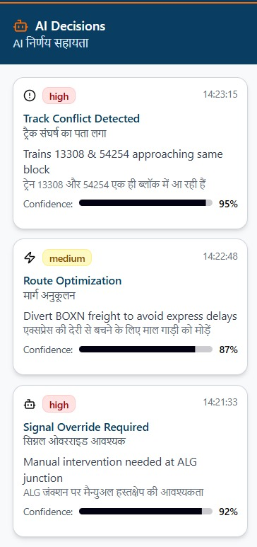
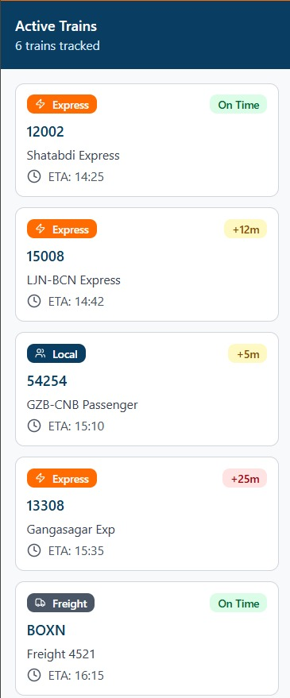

# 🚀 Trackmitra
_A smart companion for real time tracking and instant assistance._

---

## 📌 Problem Statement
SIH25022 : Maximizing section throughput using AI-Powered precise train traffic control.

---

## 💡 Our Solution
An interactive web app which will help the operational manager or any assigned officer of indian railways in assisting for the best and optimal use of sections of railways using AI decisions , automated delays prediction , etc. 

1. **REAL TIME DATA** : By using GPS signals ,timetables and edge AI for real time data and then enhance the routes and dwell timings which will help in low connectivity.
_Edge AI - When the data is not centralised instead it is localised in local servers which will reduce the time to fetch._

2. **AI ENGINE** : For dynamic reschedulling , re-optimization of tracks , alerts if any bottlenecks are there on certain sections , prediction of delays using the past history and real time data and energy consumption.

3. **CONTROLLER SUPPORT** : This is for the operational manager , a smart dashboard which explains the suggestions provided by the AI engine but also has the ability of mannual intervention and overriding for if any case the AI doesn't provide the best solution according to the officer.

4. **PASSENGER AND STATION**: It helps reducing the dwell time of a train at a particular station according to the number of passengers needed to board the train , gives accurate delay update and dynamically changes the dwell time according to it.

5. **SAFETY AND RELIABILITY**: It enforces signalling / headways . It can also work offline when in remote zones which can hinder the network , that's where the edge AI comes in play.

6. **MONITORING**: As mentioned earlier there is a dedicated kpi dashboard for the constant monitoring for the average delay , throughput per hour , how much percentage trains are on time and what is the current energy consumption.


---

## 🛠️ Tech Stack  
***Frontend***: React.js + D3.js/Mapbox + Tailwind CSS for dashboards, maps, and visualizations.

***Backend***: FastAPI/Django + PostgreSQL (TimescaleDB) + Redis + Kafka for data orchestration.

***APIs***: REST/GraphQL + WebSockets for real-time updates and external integrations.

***AI/ML***: PyTorch/TensorFlow + OR-Tools + FastAPI ML endpoints for prediction & optimization.

***Services***: Keycloak/JWT for auth, Prometheus/Grafana for monitoring, ELK for logging, SendGrid/Web Push for alerts.

***Deployment***: AWS/GCP/Azure + Docker + Kubernetes + GitHub Actions for CI/CD + PWA for offline passenger access.

---

## ✨ Features
- Maximized throughput.
- Automated decisions for reduced time and efforts.
- Real Time monitoring.
- Proactive Delay handling.
- Optimized train sequencing.
- Passenger real time info.
- Safety enforcement.
- Scalability.
- Data driven Analytics
- Reduced energy / environmental impact.
- Reduced controller workload.

---

## 🏗️ Architecture 


---

## ⚙️ Installation & Setup  

### Clone the repo  
```bash
git clone https://github.com/GitSetGoRishabh/sih-2025-trackmitra.git
cd sih-2025-trackmitra
```

### Backend setup
```bash
cd backend
npm install
npm start
```

### Frontend setup
```bash
cd frontend
npm install
npm run dev
```

---

## 📱 Demo
 

 




---

## 📑 Documentation

---


## 👨‍👩‍👧 Team Members
1. **Rishabh Singh Yadav** - Leader [GitHub](https://github.com/GitSetGoRishabh) | [LinkedIn](https://linkedin.com/in/rishabhsinghyadav0208)
2. **Sayan Jana** - [GitHub](https://github.com/httpssayan) | [LinkedIn](https://linkedin.com/in/sayan-jana-1267b8314)
3. **Akshat Yadav** - [GitHub](https://github.com/alias-codes) | [LinkedIn](https://linkedin.com/in/akshat-yadav-240467330)
4. **Kumari Ayushi Sahoo** - [GitHub](https://github.com/ayushisahoo22) | [LinkedIn](https://linkedin.com/in/ayushi-sahoo-539652341)
5. **Priyanshu Maurya** - [GitHub](https://github.com/Priyanshu1617Maurya) | [LinkedIn](https://linkedin.com/in/priyanshu-maurya-68442833b)
6. **Manya Tripathi** - [GitHub](https://github.com/manyat00) | [LinkedIn](https://linkedin.com/in/manya-tripathi-46704a303)

---

## 📜 License
This project is licensed under the MIT License.
